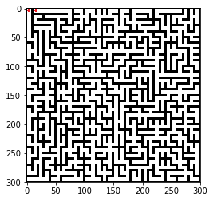

# Maze
**迷宫生成**  

***

* 随机Prim算法、递归回溯算法、递归分割算法生成迷宫
* 基于图论的破圈算法可以生成任意形状的迷宫，可以指定起点终点，可以设置解法的最小长度，避免解法过于简单
***
  
破圈算法，任意形状+指定解法的最小长度 

  
破圈算法，起点终点相邻+指定解法的最小长度  

  
随机Prim算法  

  
递归回溯算法  

  
递归分割算法  